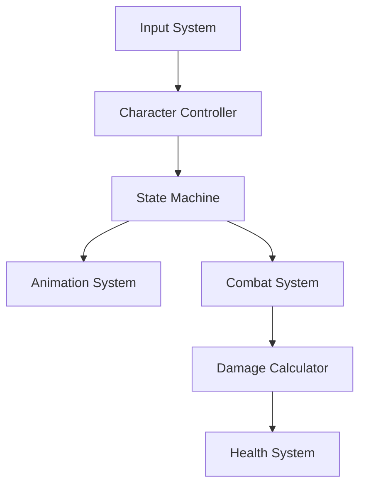

# RPG 게임 시스템 아키텍처

## 1. 개요
이 문서는 RPG 게임의 시스템 아키텍처를 설명합니다.

## 2. 핵심 시스템 구성

### 2.1 캐릭터 시스템
- 상태 기반의 캐릭터 제어 (State Pattern)
- 스탯 및 상태 효과 관리
- 애니메이션 컨트롤러 통합

### 2.2 전투 시스템
- 데미지 계산 시스템
- 스킬 시스템
- 전투 상태 관리

### 2.3 인벤토리 시스템
- 아이템 관리
- 장비 시스템
- 소모품 시스템

### 2.4 퀘스트 시스템
- 퀘스트 진행 관리
- 보상 시스템
- NPC 대화 시스템

## 3. 기술 스택
- Unity 2022.3 LTS
- C# 9.0
- Universal Render Pipeline (URP)

## 4. 디자인 패턴
- Singleton Pattern (SoundManager, ObjectPooler)
- State Pattern (캐릭터 상태 관리)
- Factory Pattern (오브젝트 생성)
- Observer Pattern (이벤트 시스템)

## 5. 데이터 흐름

## 6. 성능 고려사항
- 오브젝트 풀링 시스템 구현
- 메모리 관리 최적화
- 프레임 레이트 최적화 